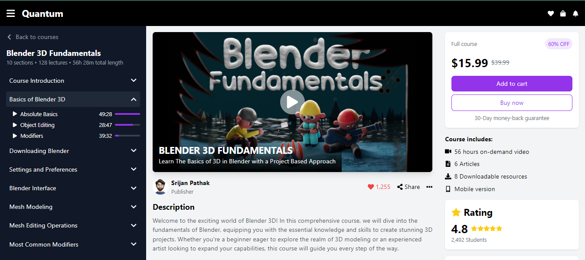

# Internship Assignment

This project is a TypeScript, Tailwind CSS, and Redux-based web application built as part of an internship assignment.

## Demo

[Visit the live demo here](#) 

## Tech Stack

- **TypeScript**: Used for static typing and improved developer experience.
- **Tailwind CSS**: A utility-first CSS framework used for rapid UI development.
- **Redux**: Used for state management across the application.

## Features

- **Responsive Design**: The UI is fully responsive and adapts to different screen sizes.
- **Global State Management**: Redux is used to manage the global state efficiently.
- **Static Site**: The website is built using Vite for faster builds and optimized performance.
